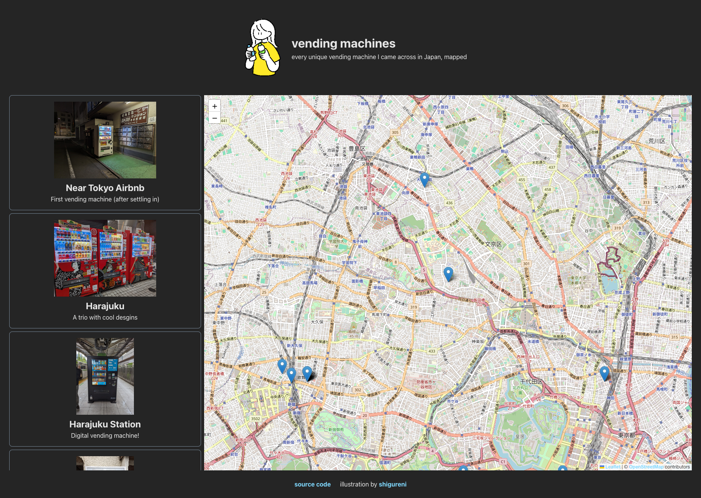

# Vending machines
I saw a lot of vendings machines during my vacation in Japan, and I took a picture every time I came across a "notable" one. Then I thought, "Wouldn't it be neat to have an interactive map of where I found these vending machines?"

Check it out [here](http://vendingmachines.kevinzou.xyz)!



## Development/Building
This project was created using Vite.

```bash
# To start development server
npm install
npm run dev

# To build for production
npm run build
npm run preview
```

## Process
I knew that my phone camera had been storing my GPS position in the metadata of photos I was taking, but I didn't know much beyond that. So that prompted to start learning about [Exchangeable Image file Format (Exif)](https://en.wikipedia.org/wiki/Exif). With the [exiftool](https://exiftool.org) utility I was able to confirm that I could pull GPS positions from my images. I did this manually for a few images, and then began the development process in earnest.

The first step was to find a library that would allow me to spin up a map interface and add custom markers. Fortunately, there are many players in this space, and I soon came across [Leaflet](https://leafletjs.com). After browsing the docs and trying a few of the examples, I was sold. There's also a helpful [React Leaflet](https://react-leaflet.js.org) library that wraps up Leaflet into React components and bindings.

Using Vite to create a React project with TypeScript support was easy, and within half an hour I had a Leaflet map rendering successfully.

From here I spent a fair amount of time wrangling the page into a layout that I liked. I decided for a Airbnb-esque layout featuring a scrollable sidebar on the left and the map on the rest of the screen. There weren't any hiccups for this part of the project, but I did try to pay attention to smaller details (CSS transitions and going for an airy and light feel).

My next task was to programmatically extract the data from all my images. I used exiftool in a Bash script to pull out various pieces of information&mdash;latitude, longitude, and created date&mdash;and output them to a file. At this point I discovered that my camera app did not have permission to my "precise location", and all the GPS positions are quite off the mark. This was an unfortunate oversight, but there isn't much I could do at this point. I've gone through some photos and manually set these positions, and I'll continue to do so (even after the Project A Week deadline, I think we can make an exception here).

## Final thoughts
Overall this was a very fun project to make, and one that I wish I had started earlier. In the spirit of Project a Week this will be the final state for this iteration. Look forward to when I pull this out into its own repo and build on it!

## Future improvements
- Show the "Date taken" somewhere in the sidebar cards
- Show image in larger resolution when clicked
- Highlight map markers when corresponding card in sidebar is hovered
- Open marker popup when corresponding card in sidebar is selected
- Make mobile friendly
- Host the images somewhere else for better loading times
